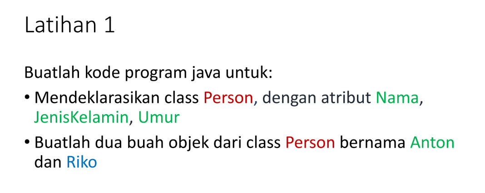

# Latihan-1

<p><b> Nama    :   Viena Dwi Putri Maulina </p>
<p><b> NIM     :   312110469 </p>
<p><b> Kelas   :   TI.21.C1 </p>
<p><b> Mata Kuliah : Pemrograman Orientasi Objek</p>
<p><b> Tugas Pertemuan 4 </p>


<p> Berikut soal dari latihan 1 <p>



berikut script javanya

```java
public class Person {
    String Nama;
    String JenisKelamin;
    int Umur;
}
```

selanjutnya membuat java baru

```java
public class Latihan1person {
    public static void main(String[] args) {

    Person a = new Person (); //Membuat objek pertama
    a.Nama = "Anton";        //Memanggil atribut dan memberi nilai
    a.JenisKelamin = "Laki Laki";
    a.Umur= 20;
    System.out.println ("Nama : " + a.Nama );
    System.out.println ("Jenis Kelamin : " + a.JenisKelamin);
    System.out.println ("Umur : " + a.Umur);

    System.out.println("     ");
    
    Person b= new Person (); //Membuat objek kedua
    b.Nama = "Riko";  //Memanggil atribut dan memberi nilai
    b.JenisKelamin = "Laki Laki";
    b.Umur = 22;
    System.out.println ("Nama : " + b.Nama );
    System.out.println ("Jenis Kelamin : " + b.JenisKelamin);
    System.out.println ("Umur : " + b.Umur);
    }
}
```

<p> Maka hasil outputnya adalah<p>

